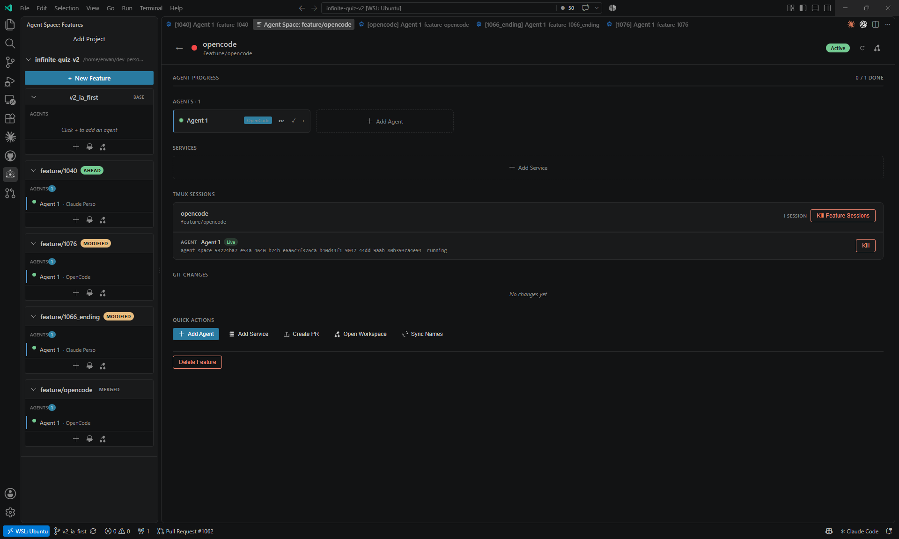
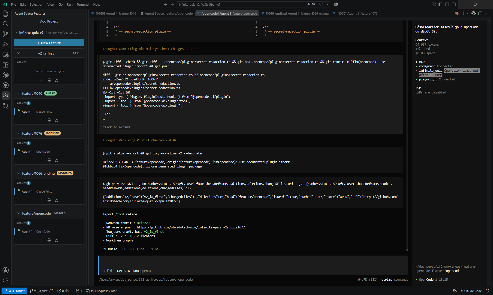

# Agent Space

Use different coding agents on the same feature — real CLIs, real terminals, real Git worktrees, and VS Code's native Git. Agent Space is a thin layer that keeps parallel work visible and durable. Build with one agent, review with another, and keep the same feature context. It does **not** replace your coding tools or orchestrate their intelligence: each agent keeps its own native terminal interface and its own session.

> **Philosophy — a layer, not an orchestrator.** Agent Space deliberately stays out of the way of the tools it hosts. You keep using whatever you can run from a terminal — `claude`, `codex`, `opencode`, `aider`, or anything else. Agent Space gives every feature an isolated Git worktree, keeps each agent's terminal alive in tmux across restarts, resumes the session when the tool supports it, and shows you exactly where everything stands.
>
> **One level below the orchestrators.** Coding tools may orchestrate agents *inside* a session — Codex, OpenCode or an opencode workspace handle that themselves. Agent Space does not compete there. It operates one level below: it organizes the independent worktrees, terminals and sessions those tools run in.

<p align="center">
  
</p>

*The cockpit: several parallel tracks visible in one place — each a real Git worktree, with its coding agents and tmux sessions kept alive in the background.*

## What It Does

- Dedicated Git worktree per feature branch
- Multiple coding CLIs running in parallel on the same feature, with each tool identified in the feature view
- Agent terminals kept alive in tmux across VS Code restarts, with session resume for supported tools
- Sidebar + home dashboard: features, agents, services and status at a glance
- Feature workspaces and PR handoff from inside VS Code

It works with any terminal-based coding CLI. Built-in presets: `claude`, `codex`, `copilot`, `opencode`, `hermes`. Add any other tool with `agentSpace.codingTools`. Pull requests adding new built-in providers are welcome; see [Creating a Provider](docs/providers/creating-a-provider.md).

## Philosophy

- **Your agents, their own minds.** Agent Space does not wrap agents, inject prompts or abstract their interfaces. The CLI you launch in a worktree is the real CLI, in the real terminal, talking to the real model you configured.
- **Real Git, native VS Code.** Feature isolation is real Git worktrees and branches. Merging, reviewing and raising pull requests stay in VS Code's native Git and GitHub experience.
- **Nothing is hidden.** Everything Agent Space manages is visible — features, agents, services, terminals, status — in the sidebar and the home dashboard.
- **Durable by design.** tmux keeps the live terminal alive across window reloads and full restarts. Supported tools can additionally resume their CLI session when a session identifier or a resume command is available.

## How It Works

1. Add a Git repository as a project.
2. Create a feature — provisions a branch and a worktree.
3. Launch one or more coding CLIs in that feature's worktree.
4. Run services (dev servers, watchers) or an interactive shell alongside the agents.
5. Reopen and resume later, open the feature workspace when needed, then open a pull request when ready.

## Why It Is Useful

- **The problem.** Several agents in the same repository can overwrite each other or lose terminal context. Agent Space keeps each feature isolated in its own Git worktree, makes active work visible, and lets long-running agent sessions survive editor restarts.
- **Why not just open terminals yourself?** A handful of terminals does not give you per-feature worktrees, durable tmux sessions that survive restarts, session resume, and a dashboard showing where everything stands — that bookkeeping is what Agent Space takes off your hands.
- **Why use it when your coding CLI already has a multi-agent system?** Those systems organize what agents do *inside* one session. Agent Space works one level below: it organizes the persistent environments — worktrees, terminals, sessions — in which the human puts those tools to work, even several at once.

## One feature, several agents

Agent Space keeps the feature/worktree stable while you choose the tool for each stage. For example:

1. Use Claude Code to implement a change in the feature worktree.
2. Add Codex to the same feature and use it as an independent reviewer.
3. Use OpenCode or another terminal-based CLI to run tests or investigate a follow-up.
4. Review the result yourself and use VS Code's native GitHub Pull Requests flow for the final handoff.

The agents remain native CLIs. Agent Space provides the shared Git worktree, terminals and project visibility; it does not route prompts or decide which model should run.

This also supports provider and budget flexibility: use the tools, subscriptions, credits or API models available to you, and change the agent without moving the feature to another workspace. This is a choice, not a promise that using several providers costs less.

## Your Coding Tools Stay Native

Agent Space hosts your coding tools without wrapping them: each agent runs its own real CLI, in its own terminal, inside its own Git worktree. In the screenshot below OpenCode shows its true native interface — running live in a worktree and session managed by Agent Space — while other agents keep working independently beside it.

<p align="center">
  
</p>

## Requirements

- **Git** for branch and worktree management
- **tmux** for persistent agent sessions
- **One coding CLI tool on PATH**: works out of the box with `claude`, `codex`, `copilot`, `opencode`, `hermes`
- **Optional custom CLI tools**: add any other terminal-based tool with `agentSpace.codingTools`
- **Windows**: VS Code Remote WSL is the recommended and supported path. Native Windows is experimental until a usable tmux runtime is qualified end-to-end.

Optional:

- [GitHub Pull Requests](https://marketplace.visualstudio.com/items?itemName=GitHub.vscode-pull-request-github) for the integrated "Create Pull Request" flow

### Runtime support

Agent Space validates the extension-host runtime, not only the desktop operating system:

| Runtime | Status |
|---|---|
| Linux native | Supported |
| macOS with tmux | Supported |
| Windows with VS Code Remote WSL | Supported and recommended |
| Native Windows | Experimental; requires a functional tmux backend |

Use `Agent Space: Doctor` to check the runtime, Git, tmux version and functional tmux smoke test in the same environment that runs the extension. If native Windows cannot run tmux reliably, reopen the repository in WSL rather than installing a package manager that is not included with standard Git for Windows.

## Quick Start

1. Install the extension.
2. Open the **Agent Space** icon in the VS Code activity bar.
3. Run `Agent Space: Add Project` and select any Git repository.
4. On first start, choose the default coding CLI when prompted.
5. Run `Agent Space: New Feature` to create a worktree and start the first agent.
6. Add more agents or start a service from the feature actions as needed.

## Core Features

### Feature-Based Workspaces

Every feature gets its own Git branch and worktree, so active changes stay isolated from other in-progress work.

### Multi-Agent Execution

Run several coding CLIs on the same feature simultaneously, mixing built-in presets with custom tools.

### Persistent Sessions

Agent terminals live in tmux, which preserves the live terminal across window reloads and full VS Code restarts. Reopening an agent can also resume the CLI's session — for a supported family (e.g. Claude, Codex, OpenCode) or when the tool defines a session identifier or a `resumeCommand`. A generic tool without its own resume protocol starts fresh.

### Sidebar and Home Dashboard

Use the activity-bar sidebar for quick actions and the home view for a broader snapshot of active features, agents, services and status.

### Managed Services

Launch package scripts such as dev servers and watch tasks, or open an interactive shell, as managed terminals attached to a feature.

### Project-Scoped Configuration

Some repositories do not branch off `main`. A `.agentspace/config.json` at the repository root lets a project declare the real **base branch**, the **branch kinds** offered at feature creation, a dedicated **worktrees directory**, and explicit **bootstrap commands** for setting up a new worktree — so Agent Space branches and creates worktrees where the project actually works.

This file holds **shareable project conventions** and may be committed, so the whole team branches consistently. It can also curate providers with `agents.enabled` and `agents.default`; when present, the allowlist is the only set shown by Add Agent. Bootstrap commands run only when explicitly invoked through `Agent Space: Bootstrap Feature Worktree`, in the feature worktree, with output visible in a dedicated terminal. They are retryable and are not run silently during feature creation. It is not implicitly gitignored.

Machine-local values go in `.agentspace/config.local.json` instead. Each project repository must explicitly ignore `.agentspace/config.local.json` in its own `.gitignore`; Agent Space never modifies another repository's ignore rules. The file has the same shape and is intended to remain untracked. It exists because `agents.enabled` is an allowlist: using a personal CLI profile on a curated project would otherwise mean naming that profile in the committed file, putting a wrapper that only exists on one machine into everyone's checkout. The overlay **adds** to `agents.enabled` rather than replacing it, so a local addition never removes a team convention; every other setting, including `agents.default`, is a plain override. Agent Space never writes to it, and `Agent Space: Doctor` reports which settings it overrides — by name, not by value.

Neither file holds tool commands. A personal CLI profile, a private sessions directory or machine-specific `env` are declared through `agentSpace.codingTools` in your user settings; `config.local.json` only decides which of those tools this project offers.

Example:

```json
{
  "baseBranch": "develop",
  "bootstrapCommands": ["bun install", "bun run generate"]
}
```

A `knowledge` block lets a project declare its **operational knowledge** for
coding agents: canonical instructions (`AGENTS.md`) and runbooks
(`.agentspace/runbooks/*.md`). Every freshly launched agent discovers them — the
launch context lists what was made available, and Doctor fails visibly on
declared-but-missing references. See
`docs/project-operational-knowledge.md`.

### Custom Coding Tools

Coding tools are plain records: `id`, `name`, `command`, plus optional `args`. This fork also supports `env`, `family`, `sessionsDir` and `resumeCommand`, and `"enabled": false` to hide a built-in. A custom entry merges over the matching built-in, keeping any field it does not specify; `env` values are merged by key, while list fields such as `args` are replaced rather than combined. A wrapped CLI (for example a variant of a supported tool that uses a separate config folder or profile) is declared the same way, and is resumed through its own executable when a session identifier or `resumeCommand` is available.

### Pull Request Handoff

Push the feature branch and open the GitHub Pull Requests extension flow from inside VS Code.

### Workspace Handoff

Open the feature worktree in a new VS Code window directly from Agent Space.

## Commands

All commands are available from the Command Palette.

| Command | Description |
|---|---|
| `Agent Space: New Feature` | Create a feature with a worktree and first agent |
| `Agent Space: Add Agent` | Add another coding agent to the active feature |
| `Agent Space: Add Service` | Start an interactive terminal or run a package script in a managed terminal |
| `Agent Space: Create Pull Request` | Push the branch and open PR creation |
| `Agent Space: Open Workspace` | Open the feature worktree in a new VS Code window and focus Source Control |
| `Agent Space: Bootstrap Feature Worktree` | Run the project-declared setup commands visibly in the selected feature worktree |
| `Agent Space: Inspect Feature Worktrees` | Report missing, detached, divergent, or valid persisted feature worktrees without mutating Git |
| `Agent Space: Inspect tmux Sessions` | Report tracked and untracked Agent Space tmux sessions without stopping or renaming them |
| `Agent Space: Clean Untracked Agent Space Sessions` | Select and explicitly confirm removal of untracked Agent Space tmux sessions; foreign sessions are excluded |
| `Agent Space: Attach Existing Agent Session` | Explicitly attach a persisted live tmux session without adopting, renaming, killing, or starting a process |
| `Agent Space: Open Feature Home` | Open the feature home view in the current window |
| `Agent Space: Delete Feature` | Remove the feature, worktree, and agent data |
| `Agent Space: Open in File Explorer` | Open the feature worktree in a new VS Code window |
| `Agent Space: Add Project` | Register a Git repository |
| `Agent Space: Remove Project` | Unregister a project |
| `Agent Space: Open Home` | Open the Agent Space dashboard |
| `Agent Space: Sync Session Names` | Sync agent names from supported CLI sessions |

## Extension Settings

| Setting | Default | Description |
|---|---|---|
| `agentSpace.defaultTool` | unset | Preferred coding tool ID for new agents. Agent Space prompts for it on first start |
| `agentSpace.codingTools` | `[]` | Register a custom terminal-based coding CLI (`id`, `name`, `command`, optional `args`/`env`/`family`/`sessionsDir`/`resumeCommand`) |
| `agentSpace.worktreeBasePath` | `".worktrees"` | Base directory for worktrees, relative to the project root |
| `agentSpace.enablePerAgentIsolation` | `false` | Give each agent its own worktree instead of sharing one per feature |
| `agentSpace.syncSessionNames` | `true` | Sync agent display names from supported CLI rename metadata |

Projects can also override branching defaults via a committed `.agentspace/config.json` at the repository root.

### Provider Support Matrix

| Provider | Launch | Session binding | Resume | Session naming | Working | Waiting |
|---|---:|---:|---:|---:|---:|---:|
| Claude | yes | yes | yes | yes | yes | only `AskUserQuestion` |
| Codex | yes | no (fail-closed) | yes* | yes* | yes* | yes* |
| OpenCode | yes | no (fail-closed) | yes* | yes* | yes* | yes* |
| Hermes | yes | no | no evidence | no evidence | no evidence | no evidence |

The matrix only claims behavior covered by structured adapter tests. An
unsupported attention capability is displayed as `Running` with an informational
"Activity tracking unavailable" detail; `unknown` is reserved for a supported
capability whose current observation cannot be read.

**Session binding** is the prerequisite for the three columns after it. Agent
Space has to know which provider session belongs to an agent before it can read
that session's title or activity, or resume it. Providers write their session
record when the human sends a first prompt, not when the CLI starts, so binding
is reconciled continuously while an agent is alive rather than captured once at
launch. An agent's current binding state is visible in `Agent Space: Doctor`.

Binding is only performed when the provider supplies an ownership correlation:
an already assigned session id resolves in the provider store, or an explicit
provider correlator returns an id using provider-specific proof for this exact
launch. Candidate discovery is not ownership proof. Codex and OpenCode can
enumerate sessions, but their current stores do not correlate a new session to
the Agent Space process, so Agent Space keeps such candidates `ambiguous` and
does not attach them automatically. A single candidate, cwd, timing, ordering,
claimant count, or internal reservation never changes that answer. Future
explicit attachment can provide the missing user-confirmed correlation.

\* Available after an explicit attachment; automatic binding is currently
limited to Claude-family's preassigned session ID path.

**Session naming** means reading a provider's persisted session title and using
it for the Agent Space display name when session-name sync is enabled. It does
not mean renaming the provider's native terminal prompt.

**Working** means a structured signal proves that the agent is actively
processing. **Waiting** means a structured signal proves that the agent needs a
human before it can continue.

Waiting is narrower than it looks for Claude. The only structured evidence in a
Claude transcript is an `AskUserQuestion` tool call; a pending tool-permission
prompt — the most common way Claude actually waits for you — leaves no distinct
event, and is indistinguishable from `working`. Agent Space reports `working` in
that case rather than guessing. Codex (`request_user_input`, approval requests)
and OpenCode (`question`, `plan_exit` tools) do expose explicit gates.

Agent Space never infers state from terminal output, and never reports `idle`
to stand in for "no evidence".

## GitHub

- Roadmap: [docs/roadmap.md](docs/roadmap.md)
- Original source: [github.com/paql4711/agent-space](https://github.com/paql4711/agent-space)
- This fork is maintained as [github.com/ShiidoTech/agent-space](https://github.com/ShiidoTech/agent-space), with generic improvements contributed back upstream
- Changelog: [CHANGELOG.md](CHANGELOG.md)
